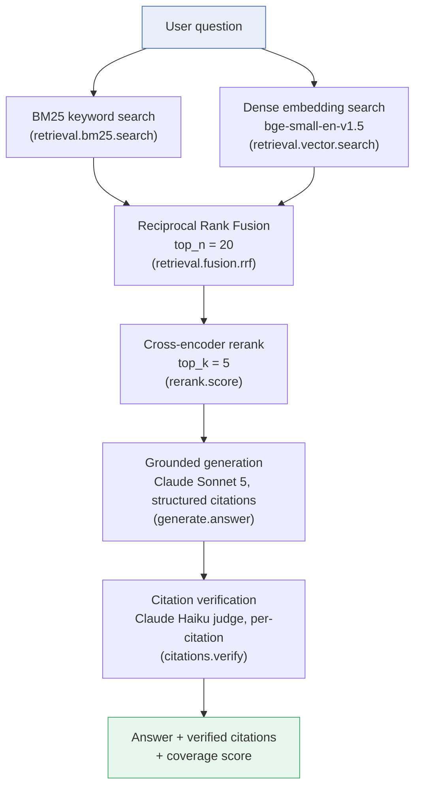
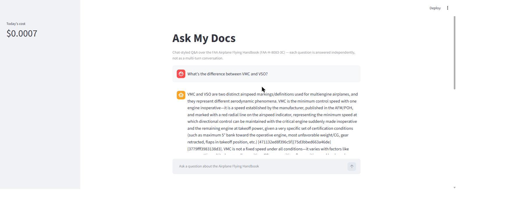
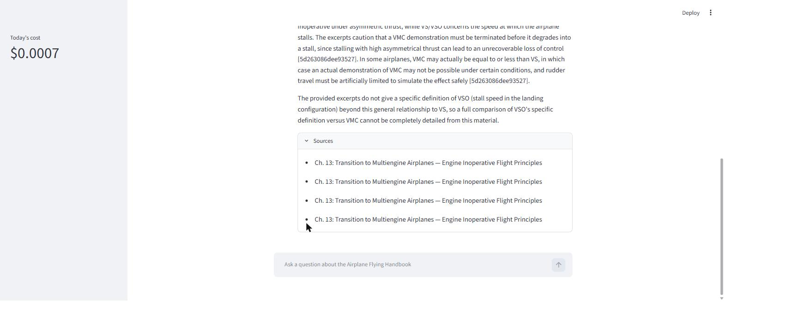
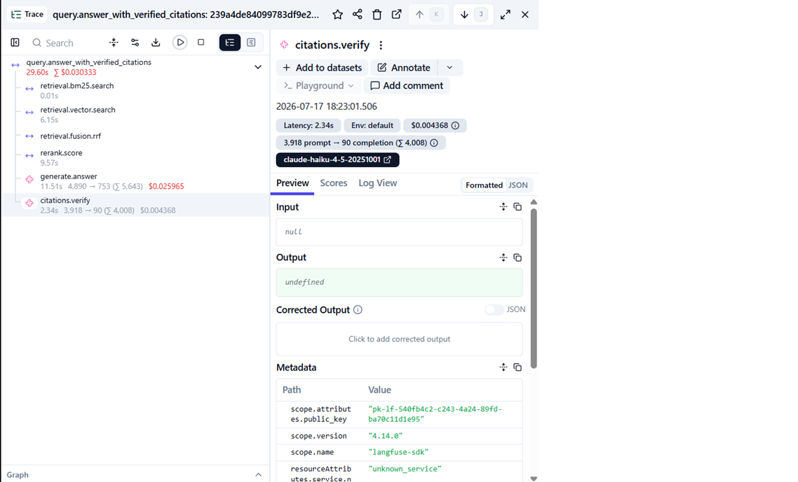

# Ask My Docs

[](https://github.com/gokuldilipkumar/ask-my-docs/actions/workflows/cheap-gate.yml)
[](https://github.com/gokuldilipkumar/ask-my-docs/actions/workflows/nightly-eval.yml)

A production-shaped, domain-specific RAG system over the FAA Airplane Flying Handbook
(FAA-H-8083-3C, 406 pages) — hybrid retrieval, cross-encoder reranking, grounded
generation with verified citations via the Anthropic API, an evaluation harness with a CI
quality gate, and full request tracing via Langfuse.

## Why this exists

Most RAG demos stop at "it retrieves and generates an answer." That's not production-shaped
— there's no way to know if an answer is *right*, no way to catch a regression when a
prompt or chunking strategy changes, and no visibility into cost, latency, or failure rate.

This project is built the other way around: the retrieval/generation pipeline is maybe 20%
of the actual work. The rest is proving it works, catching it when it breaks, and being
able to say exactly what a query cost. Concretely:

- Every citation in an answer is verified against its source chunk by a second LLM pass —
  not just formatted, checked.
- A CI gate runs on every push and fails automatically if a change regresses retrieval
  quality (see [`docs/eval-report.md`](docs/eval-report.md) for a real example of this
  gate catching a real regression).
- Every query produces a traced, cost/latency-instrumented request in Langfuse.

## Architecture



This whole flow runs inside one Langfuse trace (`query.answer_with_verified_citations`) —
see [Observability](#observability) below for a real trace screenshot.

### Why hybrid retrieval + RRF fusion?

BM25 (lexical) and dense embeddings (semantic) fail on different queries — BM25 misses
paraphrases and synonyms, dense search misses exact terminology matches (V-speed notation
like `VMC`/`VSO` is exactly this case). Running both and fusing their rankings with
Reciprocal Rank Fusion (rank-based, not score-based — the two retrievers' raw scores aren't
on comparable scales) gets the benefit of both without needing to calibrate one scoring
system against the other.

### Why rerank?

Hybrid retrieval is tuned for *recall* — cast a wide net (`top_n = 20`) so relevant chunks
aren't missed. A cross-encoder reranker then does a more expensive, more accurate
pairwise scoring pass to pick the best `top_k = 5` for generation. Cheap-then-precise beats
either alone.

### Why citation verification, and why it isn't enough

`citations.verify` checks that each chunk a generated answer *cites* is actually relevant to
the question — catching a real class of bug (a model citing an unrelated chunk). What it
cannot catch: fabricated prose that cites a genuinely relevant chunk but claims more than
that chunk supports. This actually happened during development — a generated answer
invented an 8-item "common errors" list not present anywhere in the corpus, while citing a
single, genuinely-relevant chunk. Citation verification correctly passed it (the citation
*was* relevant); the answer-quality judge in the eval harness caught the fabrication. See
[`docs/eval-report.md`](docs/eval-report.md) for the full story — this is exactly why the
system has two separate quality layers, not one.

## Quickstart

```
$ uv sync
Resolved 102 packages in 2ms
Checked 80 packages in 5ms
```

The built index ships in the repo (`data/index/`, ~2.4MB), so querying works immediately —
no need to re-ingest the 273MB source PDF first. (`ingest` is available if you want to
rebuild it: `PYTHONPATH=src uv run python -m app.main ingest --pdf "<handbook>.pdf" --out data/index`,
~3.5 minutes real time on this corpus.)

This project uses a `src/` layout (`src/ingest/`, `src/app/`, etc.), and pytest's own
`pythonpath = ["src"]` setting (`pyproject.toml`) only applies inside pytest — any manual,
non-pytest invocation (`python -m app.main`, `streamlit run`, ...) needs `PYTHONPATH=src` set
explicitly, or it fails with `ModuleNotFoundError: No module named 'app'`.

```
$ PYTHONPATH=src uv run python -m app.main query --question "What is the FAA Wings Program?" --index data/index

The FAA WINGS Program (formally the Pilot Proficiency Awards Wings Program) is a program
that provides continuing pilot education, offering study materials and resources pilots
can use year-round to enhance their proficiency, safety, and enjoyment of flying. Many
pilots use the WINGS program to keep their flight review up-to-date, as an alternative or
complement to the minimum training requirements of 14 CFR part 61, section 61.56(c)(1) and
(2). A pilot can create a WINGS account by logging on to www.faasafety.gov...

Citations: 8a3abce28a33f108, d8a911e5b2ec60c0
Coverage: 1.00
Daily cost so far: $0.0804
```

```
$ PYTHONPATH=src uv run python -m app.main eval --index data/index --retrieval-only

mean_recall_at_k: PASS (current=0.616, baseline=0.616)
mean_mrr: PASS (current=0.906, baseline=0.906)
mean_ndcg: PASS (current=0.783, baseline=0.783)
Daily cost so far: $0.2733
```

`--retrieval-only` itself makes zero API calls — the cost line reports the day's running
total across *all* activity (this session's live tests and `query` calls included), not a
cost specific to this command. This is the same command `cheap-gate.yml` runs on every push — zero API cost, deterministic,
compares against the tracked baseline in `eval/baselines/`. See
[`docs/eval-report.md`](docs/eval-report.md) for what the full judge-based eval mode
(`nightly-eval.yml`) measures, and for a real, reproducible example of this gate catching an
actual regression.

```
$ uv run pytest -m "not slow"
141 passed, 17 deselected

$ uv run pytest
152 passed, 6 skipped
```

(Skipped tests hit real paid APIs — Anthropic and Langfuse — gated behind
`RUN_LIVE_API_TESTS=1` / `RUN_LIVE_LANGFUSE_TESTS=1` so CI and casual local runs never
spend money by accident.)

## Chat Interface

A Streamlit chat UI wraps `answer_with_verified_citations` for anyone who'd rather ask
questions in a browser than via the CLI. It's chat-*styled* — a running thread of past
turns — but each question is still answered independently; there's no conversational memory
or follow-up resolution (`answer_with_verified_citations` takes one flat question, not a
history), so a second question doesn't implicitly refer back to the first.

Run it locally:

```
$ PYTHONPATH=src uv run streamlit run src/app/streamlit_app.py
```

(`PYTHONPATH=src` is required for the same reason it's required for `python -m app.main` —
see the Quickstart section's `src/`-layout note above; `streamlit run` is a manual,
non-pytest invocation too.)

A real question against the real corpus, answered live:



Citations resolve to a human-readable chapter/section, not a raw chunk-id hash — the
`data/index/chunk_metadata.json` sidecar (written at `ingest` time) makes that possible:



Two things worth calling out honestly rather than glossing over:

- The generated answer's *inline* bracketed citations (`[471132ed8f396c5f]`) are the
  generation prompt's own citation format (`prompts/answer_v1.md` instructs the model to
  cite every claim by chunk id in the prose itself) — a separate mechanism from the
  structured `citations` field the Sources panel resolves. Rewriting inline prose citations
  would mean post-processing free-form LLM output, out of scope here.
- Because `printed_page_label` isn't wired to page-footer detection yet (a pre-existing,
  deliberately deferred gap — see `BUGS.md`), several citations from the same handbook
  section render identically (e.g. four "Ch. 13: ... Engine Inoperative Flight Principles"
  entries above) — real corpus behavior, not a display bug, and a direct consequence of that
  known limitation.

**Deploying**: pushing this repo to a GitHub-linked [Streamlit Community
Cloud](https://streamlit.io/cloud) account turns this into a shareable public demo link —
that's a manual step tied to your own Streamlit account, not something this repo automates.

## Observability

Every query runs inside one Langfuse trace, with every pipeline stage as a nested,
cost/latency-instrumented span:



A daily running cost total (sqlite-backed, survives process restarts) is checked against a
configurable budget cap (`observability.daily_cost_cap_usd`) after every real API call —
exceeded budget logs a warning rather than blocking a query or an in-progress eval run, since
a hard block mid-run is worse than a loud warning.

## Evaluation

8 golden questions, LLM-labeled-then-human-reviewed ground truth, retrieval metrics
(Recall@k / MRR / nDCG) plus an independent LLM judge for answer correctness and
completeness. Full methodology, current baseline numbers, and a real regression the CI gate
caught: [`docs/eval-report.md`](docs/eval-report.md).

## Stack

Python 3.11+, CPU-only (no GPU) — `bm25s` + `lancedb`/`sentence-transformers` for hybrid
retrieval, a local cross-encoder for reranking, the Anthropic API (Claude Sonnet 5 for
generation, Claude Haiku for judges) for everything LLM-shaped, `langfuse` for tracing,
`typer` for the CLI. Built with a strict TDD workflow — see `.agent/decisions.log` and
`LEARNING_NOTES.md` for the reasoning behind every non-obvious design choice.
